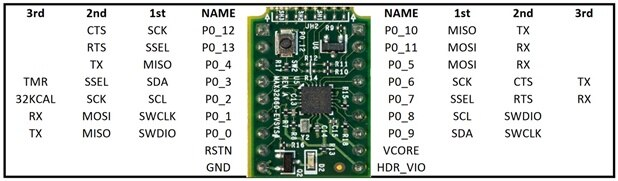

## MAX32660 SPI Toolkit
This repository serves to demonstrate additional uses for the I2C and SPI buses which Maxim/Analog do not include in their
surprisingly limited documention contained in the Maxim SDK. Really, all you're going to demonstrate is checking whether
the bus works by sending a signal to myself? Not even an ounce of code to test an external device? Get real.

## Required Connections
Obviously, you only need connections for whatever peripheral you are using. If you are on I2C, you need SDA and SCL
between the MCU and the peripheral, and for SPI you need MOSI, MISO, CS, and SCK. The image below is helpful 
reference if using the Eval Kit:

Useful to note that in the case of SPI, the default MOSI and MISO are P0.5 and P0.4 respectively, not P0.11/P0.10/P0.0/P0.1.
If you want to use those you'll have to use the Maxim SDK's guide for altering those pinouts. If you're smart, just use
the default ones, it's on a breadboard anyway. Grow up. 

## Errata
- You definitely want to pull-up the *Write Protect* and *Hold* pins on your SPI storage. The standard is that
they'll float if unused, and that being set to 1 indicates ignoring those lines. In all the code used in this 
repository, both pin functions are unusued, thus it is highly recommended to pull-up; personally, we've been used 2.2kΩ resistors.
